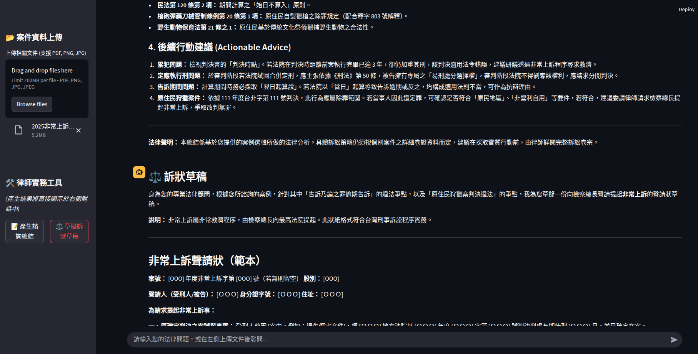

# AI Lawyer 台灣法規 AI 助手

這個專案是一個基於 Gemini 模型的 AI 法律諮詢助理，整合了 [wasonisgood-legel-mcp](https://github.com/wasonisgood/legel-mcp) 本地端 MCP (Model Context Protocol) 伺服器，使 AI 能夠透過呼叫工具 (Tool Calling) 查閱最新的台灣法律條文再回答問題。

## 核心功能與檔案

1. **`app.py`（Prototype UI）**：
   - 提供基於 `streamlit` 建置的簡易測試介面，可以直接貼上法條 (Context) 和問題 (Question)，透過 Gemini 嚴謹地回答內容（無連線 MCP，純 Context 問答測試）。
2. **`run_mcp.py`（MCP Server Integration）**：
   - 使用 `langchain-mcp-adapters` 及 `langgraph` 連接本地指令模式 (stdio) 的 `legel-mcp` 伺服器。
   - LangChain React Agent 在面對問題（例如「請問台灣刑法對於公然侮辱的罰則是什麼？」）時，會自主調用檢索法規工具，避免知識幻覺 (Hallucination) 並提升精確度。
3. **`legel-mcp/`**：
   - 官方提供的台灣開源 MCP 專案庫，包含內建的台灣法律資料與檢索腳本 (`mcp_server_final.py`)。

## 開發指南

有關環境建置的詳細資訊（如建立 `.env` 與 Conda 環境），請參考 [`ai_notice/GUIDELINES.md`](ai_notice/GUIDELINES.md)。
